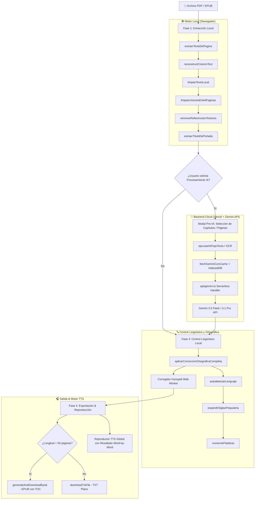

# 📚 Dr. Media - Transcriptor Total (Optimizado para TTS)

Esta es una aplicación web ultra-premium alojada en **Vercel** (con backend en **Serverless Functions** de Node.js/TypeScript) y potenciada por la **API de Gemini (Google AI)**. Está diseñada para transcribir, limpiar, reestructurar y optimizar libros y documentos PDF para que sean leídos con fluidez impecable por motores de **Texto a Voz (Text-to-Speech / TTS)** como *Voice Aloud Reader*, *Audible*, *Narrador de Windows*, *Android Speech*, entre otros.

El objetivo principal es eliminar de forma inteligente cualquier obstáculo de lectura en audio (como citas bibliográficas parentéticas, guiones de salto de línea, URLs complejas, llamadas a figuras/tablas, números romanos y abreviaturas) e integrar de forma fluida las notas al pie dentro de la lectura principal, asegurando una pronunciación, gramática y coherencia semántica perfectas.

---

## 🎯 Estrategia de Triple Canal: Extracción + IA + Calidad Lingüística

La aplicación implementa una **estrategia de tres fases secuenciales** para superar los límites de tamaño de archivo y tiempo de ejecución, combinando velocidad local y razonamiento semántico avanzado:

### Fase 1: Extracción Local y Reconstrucción de Diseño (Layout-Aware)

El usuario carga un archivo PDF en el navegador mediante drag-and-drop. De inmediato, la aplicación realiza:

* **Extracción Paralela Local**: Extrae texto usando PDF.js en paralelo (hasta 3 hilos concurrentes).
* **Extracción Inteligente de Capítulos Nativos (Bookmarks)**: Lee la tabla de contenidos (*Outlines*) incrustada originalmente en el archivo PDF y correlaciona cada título de capítulo exacto con su número de página para la segmentación y navegación TTS.
* **Detección e Hilado de Doble Columna (Multi-column segmenter)**: Analiza el histograma de coordenadas horizontales (`x`) de todos los fragmentos y calcula el espacio del canal central (*gutter*). Si detecta un diseño de doble columna (menos del 15% de líneas cruzando el centro), segmenta la página en dos y une la columna izquierda primero, seguida de la columna derecha. **¡Esto elimina por completo el mezclado de frases que arruina la lógica de lectura!**
* **Omisión Selectiva de Tablas en Local**: Remueve automáticamente tablas completas en el flujo de texto local utilizando una heurística inteligente (detectando marcadores como `Tabla \d+` y evaluando la vuelta al texto discursivo normal).
* **Limpieza de Colaboradores y Bibliografía**: Detecta y elimina automáticamente largas listas de colaboradores institucionales, afiliaciones y referencias bibliográficas al final de los capítulos utilizando heurísticas avanzadas.
* **Deduplicación Dinámica**: Detecta y elimina automáticamente cabeceras y pies de página recurrentes analizando la coincidencia inter-página, sin necesidad de escribir reglas manuales por libro.
* **Reconstrucción de Párrafos y Desguionizado**: Elimina los saltos de línea molestos de PDF y une palabras cortadas por límites de margen (`medi- \ncina` → `medicina`).
* **Protección de Títulos de Artículos vs. Revistas**: Previene que títulos repetitivos de revistas científicas o encabezados de páginas sobreescriban el título principal del documento o artículo.

### Fase 2: Selección Pre-IA y Adaptación Semántica (Modelos Gemini)

Si el usuario requiere una adaptación más compleja o documentos escaneados/OCR, puede pulsar **"Iniciar IA"**:

* **Modal de Selección Pre-IA**: Permite elegir procesar todo el libro, un *rango numérico de páginas*, o **capítulos específicos** basados en marcadores nativos.
* **Fragmentación Dinámica**: Divide el documento en bloques (~2500 palabras por bloque) y los envía al backend de Vercel (`/api/gemini`) con resiliencia de red y reintentos exponenciales (*exponential backoff*).
* **Limpieza Estructural Estricta**: La IA elimina bibliografías, referencias al final y afiliaciones de autores.
* **Notas al Pie en Línea**: Inserta notas explicativas inmediatamente después del concepto aludido en el párrafo principal.
* **Tratamiento Semántico de Tablas**: Interpreta y reescribe tablas de forma continua y narrada.

### Exportación Dinámica (TXT vs EPUB)

El sistema decide automáticamente el formato de exportación:

* **Libros extensos (> 50 páginas)**: Exportados automáticamente en **formato `.epub`** con marcadores de capítulos funcionales (`# `) delimitados limpiamente y metadatos completos para reproductores TTS.
* **Artículos y Papers (< 50 páginas)**: Exportados en texto plano (`.txt`) para una lectura ligera.

### Fase 3: Control de Calidad Lingüístico y Corrección Ortográfica Híbrida

* **Normalización Unicode NFC**: Resuelve acentos rotos u OCR flotante (`cl ínica` → `clínica`).
* **Autodetección de Idioma**: Analiza la frecuencia de palabras funcionales (*es* vs. *en*) para cargar diccionarios y reglas adecuadas.
* **Corrección Ortográfica IA (Gemini)**: Restauración gramatical respetando la jerga médica y clínica.
* **Corrección Hunspell en Hilo Secundario (Web Worker)**: Motor de corrección local Typo.js súper acelerado (edit distance 1) ejecutado en segundo plano sin congelar la interfaz. Permite revertir a la **"Versión Pura"** en cualquier momento.
* **Diccionario Bilingüe de Siglas Clínicas y Dosis**: Expande acrónimos según el idioma (`TCA` → *"trastorno de la conducta alimentaria"*, `mg` → *"miligramos"*).
* **Expansión Avanzada de Números Romanos (I–XXX)**: Convierte números romanos a palabras legibles con salvaguardas de iniciales de nombres propios.

---

## 🗺️ Mapa de Funciones y Arquitectura del Sistema

A continuación se presenta el mapa arquitectónico completo de la aplicación, detallando el flujo de datos y la distribución de responsabilidad entre módulos.

### Flujo Global de Datos (Diagrama de Arquitectura)



---

### Mapa Detallado de Funciones por Módulo

| Módulo / Archivo                                                                       | Función Principal                            | Descripción y Responsabilidad                                                                                                                      |
| :-------------------------------------------------------------------------------------- | :-------------------------------------------- | :-------------------------------------------------------------------------------------------------------------------------------------------------- |
| **`src/utils/textCleaner.ts` & `src/main.ts`**  *(Motor de Limpieza Local)* | `limpiarTextoLocal(texto)`                  | Aplica reglas Regex avanzadas para eliminar citas APA, notas parentéticas, URLs, guiones de salto de línea, marcas de agua y basura tipográfica. |
|                                                                                         | `limpiarUnionesEntrePaginas(texto)`         | Elimina cabeceras y pies de página recurrentes inter-página y reestructura párrafos divididos entre páginas.                                    |
|                                                                                         | `removerReferenciasYAutores(texto)`         | Identifica y recorta secciones finales de bibliografía y listas de colaboradores mediante análisis de score semántico.                           |
|                                                                                         | `esNombreDeRevistaOSeccion(linea)`          | Filtra encabezados de revistas científicas para prevenir sobreescrituras en los títulos de los artículos.                                        |
|                                                                                         | `omitirTablasLocal(texto)`                  | Remueve bloques de tablas nativas en el flujo local para evitar lecturas discontinuas de datos tabulares.                                           |
| **`src/main.ts`**  *(Extracción & Layout PDF)*                               | `extraerTextoDePagina(page)`                | Lee bloques de texto y coordenadas X/Y desde PDF.js.                                                                                                |
|                                                                                         | `reconstructColumnText(fragments, marginX)` | Detecta automáticamente si una página tiene 1 o 2 columnas y reordena los bloques para evitar la mezcla de líneas.                               |
|                                                                                         | `extraerTituloDePortada(textoPortada)`      | Extrae el título principal y autor del libro/artículo protegiéndose de nombres de journals.                                                      |
|                                                                                         | `extraerCapitulos(texto)`                   | Segmenta el texto final usando expresiones de títulos o marcadores`# ` en bloques con título y contenido.                                       |
| **`src/main.ts` & `api/gemini.ts`**  *(Orquestación IA & Caché)*          | `iniciarIAEspecifico(fileId)`               | Abre el modal Pre-IA y prepara la segmentación por páginas o capítulos.                                                                          |
|                                                                                         | `ejecutarIAFlujoTexto(fileObj)`             | Fragmenta el texto en bloques de ~2500 palabras y los procesa concurrentemente con trabajadores IA.                                                 |
|                                                                                         | `ejecutarIAFlujoOCR(fileObj)`               | Convierte páginas escaneadas a imágenes WebP/JPEG y realiza OCR semántico con Gemini Flash.                                                      |
|                                                                                         | `fetchGeminiConCache(payload, label)`       | Realiza peticiones HTTP al backend serverless utilizando caché en**IndexedDB** para evitar consumo redundante de tokens.                     |
|                                                                                         | `initCacheDB() / clearAllCache()`           | Inicializa y administra la base de datos IndexedDB local para almacenar y limpiar respuestas previa evaluación.                                    |
|                                                                                         | `handler(req, res)` *(Backend Vercel)*    | Endpoint serverless`/api/gemini` que gestiona claves de API, prompts estructurados y llamadas resilientes a Google Generative AI.                 |
| **`src/main.ts` & `src/hunspellWorker.ts`**  *(Calidad Lingüística)*      | `aplicarCorreccionOrtograficaCompleta(...)` | Orquesta la normalización Unicode NFC, desguionizado final y expansión de abreviaturas clínicas.                                                 |
|                                                                                         | `autodetectarLenguaje(texto)`               | Identifica automáticamente si el documento está en español (`es`) o inglés (`en`).                                                          |
|                                                                                         | `expandirSiglasPsiquiatria(texto, lang)`    | Sustituye acrónimos clínicos (`TCA`, `TDAH`, `SSRI`, `ECT`) y unidades (`mg`, `mcg`) por su pronunciación hablada.                   |
|                                                                                         | `numeroAPalabras(numStr, lang)`             | Transforma números romanos (I–XXX) a ordinales o cardinales hablados.                                                                             |
|                                                                                         | `initHunspellWorker(lang)`                  | Carga asíncronamente diccionarios`.aff` y `.dic` en un Web Worker dedicado.                                                                    |
|                                                                                         | `corregirOrtografiaHunspellLocal(...)`      | Realiza corrección ortográfica de alto rendimiento en hilo secundario mediante Typo.js optimizado.                                                |
| **`src/main.ts`**  *(Interfaz, UI & Exportación)*                            | `renderFileCard(fileObj)`                   | Renderiza la tarjeta interactiva de cada documento cargado con soporte de edición manual de título y progreso.                                    |
|                                                                                         | `generateAndDownloadEpub(filename, text)`   | Compila y empaqueta un archivo`.epub` completo con tabla de contenidos (TOC) y metadatos.                                                         |
|                                                                                         | `downloadTxtFile(filename, text)`           | Descarga archivos de texto plano`.txt`.                                                                                                           |
|                                                                                         | `exportarDocumento(fileObj, suffix, text)`  | Determina dinámicamente si el archivo debe ser`.epub` (>50 págs) o `.txt` (<50 págs).                                                        |
|                                                                                         | `restaurarTextoPuro(fileId)`                | Permite al usuario revertir cualquier cambio ortográfico a la versión pura extraída.                                                             |

---

## 🧠 Diccionario de Siglas Psiquiátricas y Unidades Médicas Integradas

Para garantizar que el motor TTS lea las siglas como palabras completas y no letra por letra, el sistema expande las siguientes nomenclaturas clínicas:

| Sigla / Abrev.                              | Idioma Detectado: Español (`es`)                          | Idioma Detectado: Inglés (`en`)                 |
| :------------------------------------------ | :----------------------------------------------------------- | :------------------------------------------------- |
| **TCA** / **TCAs**              | trastorno(s) de la conducta alimentaria                      | tricyclic antidepressant(s)*(Evita colisión)*   |
| **AN** / **BN**                 | anorexia nerviosa / bulimia nerviosa                         | anorexia nerviosa / bulimia nerviosa               |
| **TA** / **BED**                | trastorno por atracón                                       | binge eating disorder*(BED es solo mayúsculas)* |
| **TOC** / **OCD**               | trastorno obsesivo compulsivo                                | obsessive-compulsive disorder                      |
| **TAG** / **GAD**               | trastorno de ansiedad generalizada                           | generalized anxiety disorder                       |
| **TDAH** / **ADHD**             | trastorno por déficit de atención e hiperactividad         | attention-deficit hyperactivity disorder           |
| **TEA** / **ASD**               | trastorno del espectro autista                               | autism spectrum disorder                           |
| **TLP** / **BPD**               | trastorno límite de la personalidad                         | borderline personality disorder                    |
| **TAB** / **BD**                | trastorno afectivo bipolar                                   | bipolar disorder                                   |
| **TDM** / **MDD**               | trastorno depresivo mayor                                    | major depressive disorder                          |
| **TEPT** / **PTSD**             | trastorno de estrés postraumático                          | post-traumatic stress disorder                     |
| **TEPT-C** / **CPTSD**          | trastorno de estrés postraumático complejo                 | complex post-traumatic stress disorder             |
| **TUS** / **SUD**               | trastorno por uso de sustancias                              | substance use disorder                             |
| **TID** / **DID**               | trastorno de identidad disociativo                           | dissociative identity disorder                     |
| **TDC** / **BDD**               | trastorno dismórfico corporal                               | body dysmorphic disorder                           |
| **TEC** / **ECT**               | terapia electroconvulsiva                                    | electroconvulsive therapy                          |
| **TCC** / **CBT**               | terapia cognitivo conductual                                 | cognitive behavioral therapy                       |
| **EMDR**                              | desensibilización por movimientos oculares                  | eye movement desensitization and reprocessing      |
| **EMTr** / **rTMS**             | estimulación magnética transcraneal repetitiva             | repetitive transcranial magnetic stimulation       |
| **PANSS**                             | escala de los síndromes positivo y negativo                 | positive and negative syndrome scale               |
| **TP** / **TPs** / **PD** | trastorno(s) de la personalidad                              | personality disorder(s)                            |
| **IMC** / **BMI**               | índice de masa corporal                                     | body mass index                                    |
| **APA**                               | Asociación Psiquiátrica Americana                          | American Psychiatric Association                   |
| **ISRS** / **SSRI**             | inhibidores selectivos de la recaptación de serotonina      | selective serotonin reuptake inhibitor             |
| **IRSN** / **SNRI**             | inhibidores de la recaptación de serotonina y noradrenalina | serotonin-norepinephrine reuptake inhibitor        |
| **mg** / **ml**                 | miligramos / mililitros                                      | milligrams / milliliters                           |
| **mcg** / **μg**               | microgramos                                                  | micrograms                                         |
| **g** / **kg**                  | gramos / kilogramos*(con número previo)*                  | grams / kilograms*(con número previo)*          |

### Números Romanos Expandidos (I–XXX)

| Romano               | Español                                                                                                                  |
| :------------------- | :------------------------------------------------------------------------------------------------------------------------ |
| **I – X**     | primero, segundo, tercero, cuarto, quinto, sexto, séptimo, octavo, noveno, décimo                                       |
| **XI – XX**   | once, doce, trece, catorce, quince, dieciséis, diecisiete, dieciocho, diecinueve, veinte                                 |
| **XXI – XXX** | veintiuno, veintidós, veintitrés, veinticuatro, veinticinco, veintiséis, veintisiete, veintiocho, veintinueve, treinta |

> ⚠️ **Salvaguarda de iniciales**: Las reglas para `I` y `V` utilizan lookbehind/lookahead negativos avanzados para proteger iniciales de nombres propios (ej. `Dr. J. I. Castro` permanece intacto).

---

## ✨ Características de Diseño y UI (Ultra-Premium)

* **Estética Moderna e Interfaz Oscura**: Diseñado con **Tailwind CSS v4** y tipografía **Outfit** de Google Fonts.
* **Edición Manual de Títulos**: Permite al usuario editar el título del documento directamente en su tarjeta para personalizar el nombre de los archivos exportados.
* **Caché Persistente en IndexedDB**: Almacena las respuestas de IA localmente para evitar rehacer peticiones redundantes. Incluye botón para **Limpiar Caché Global**.
* **Reproductor TTS Global Integrado**: Modal interactivo de pantalla completa con controles de audio y seguimiento en tiempo real palabra por palabra (`SpeechSynthesis` `onboundary`).
* **Carga Diferida de Diccionarios Hunspell**: Los diccionarios `.aff` y `.dic` se descargan asíncronamente bajo demanda sólo cuando se requiere la corrección ortográfica local.
* **Web Workers Nativo**: Ejecuta Typo.js en segundo plano sin congelar la pestaña ni interferir con la navegación del usuario.
* **Selector de Modelos Gemini**: Configuración flexible entre `Gemini 3.5 Flash` (predeterminado), `Gemini 3.1 Flash-Lite`, o `Gemini 3.1 Pro`.

---

## 🏗️ Estructura del Proyecto

```
├── index.html              # Plantilla HTML base (cargada por Vite)
├── api/                    # Backend Serverless en Vercel
│   └── gemini.ts           # Endpoint /api/gemini (Node.js/TypeScript)
├── public/                 # Archivos estáticos y diccionarios
│   └── dictionaries/       # Diccionarios Hunspell (.aff y .dic)
├── src/                    # Código fuente Frontend TypeScript
│   ├── main.ts             # Orquestador principal (UI, Estado, Eventos, TTS)
│   ├── hunspellWorker.ts   # Web Worker para Typo.js optimizado
│   ├── styles/
│   │   └── index.css       # Directivas de Tailwind CSS v4
│   ├── ui/
│   │   └── dashboard.ts    # Componentes e interfaz de usuario
│   └── utils/
│       ├── textCleaner.ts  # Expresiones regulares, OCR y reglas lingüísticas
│       └── pdfExtractor.ts # Utilidades complementarias de PDF
├── tests/                  # Pruebas unitarias automatizadas (Node test runner)
│   ├── limpieza.test.js    # Pruebas de desguionizado y limpieza local
│   └── reglas.test.js      # Pruebas de expansión de siglas y números romanos
├── vite.config.js          # Configuración de Vite
├── tsconfig.json           # Configuración de TypeScript
└── package.json            # Dependencias NPM y scripts de compilación
```

---

## ⚙️ Desarrollo y Despliegue

### Prerrequisitos

- Node.js ≥ 18
- NPM

### Instalación

```bash
npm install
```

### Modo de Desarrollo Local (Vite)

```bash
npm run dev
```

Abre `http://localhost:5173`. Asegúrate de ingresar tu clave de API de Gemini en el modal de configuración de la UI o mediante un archivo `.env` local.

### Ejecución de Pruebas Automatizadas

```bash
npm test
```

### Despliegue en Vercel (Recomendado 🚀)

1. Conecta el repositorio de GitHub a tu cuenta de Vercel.
2. Vercel detectará la configuración de **Vite** y el script de compilación `npm run build`.
3. Configura la variable de entorno `GEMINI_API_KEY` en **Environment Variables**.
4. ¡Listo! Vercel desplegará automáticamente la aplicación y las funciones serverless de la carpeta `api/`.

### Despliegue en Google Apps Script (Opcional)

```bash
npm run deploy-clasp
```

---

## 📄 Licencia

Este proyecto está bajo la licencia **ISC**.
